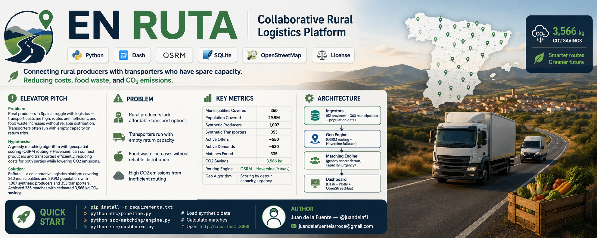

<p align="center">
  
</p>

# EN RUTA — Collaborative Rural Logistics Platform


> **Connecting rural producers with transporters who have spare capacity. Reducing costs, food waste, and CO2 emissions.**

---

## Elevator Pitch

**Problem**: Rural producers in Spain struggle with logistics — transport costs are high, routes are inefficient, and food waste increases without reliable distribution. Transporters often run with empty capacity on return trips.

**Hypothesis**: A greedy matching algorithm with geospatial scoring (OSRM routing + Haversine) can connect producers and transporters efficiently, reducing costs for both parties while lowering CO2 emissions.

**Solution**: EnRuta — a collaborative logistics platform covering **360 municipalities** and **29.9M population**, with **1,007 synthetic producers** and **353 transporters**. Achieved **335 matches** with estimated **3,566 kg CO2 savings**.

---

## Problem

- Rural producers lack affordable transport options
- Transporters run with empty return capacity
- Food waste increases without reliable distribution
- High CO2 emissions from inefficient routing

## Key Metrics

| Metric | Value |
|--------|-------|
| Municipalities Covered | **360** |
| Population Covered | **29.9M** |
| Synthetic Producers | **1,007** |
| Synthetic Transporters | **353** |
| Active Offers | ~550 |
| Active Demands | ~530 |
| Matches Found | **335** |
| CO2 Savings | **3,566 kg** |
| Routing Engine | OSRM + Haversine (fallback) |
| Geo Algorithm | Scoring by detour, capacity, urgency |

## Architecture

```
Ingestors (52 provinces + 360 municipalities + population data)
       |
Geo Engine (OSRM routing + Haversine fallback)
       |
Matching Engine (greedy score: detour, capacity, urgency)
       |
Dashboard (Dash + Plotly + OpenStreetMap)
```

## Quick Start

```bash
pip install -r requirements.txt
python src/pipeline.py              # Load synthetic data
python src/matching/engine.py       # Calculate matches
python src/dashboard.py             # Open http://localhost:8050
```

---

## Author

**Juan de la Fuente** — [@juandelaf1](https://github.com/juandelaf1)

juandelafuentelarrocca@gmail.com
